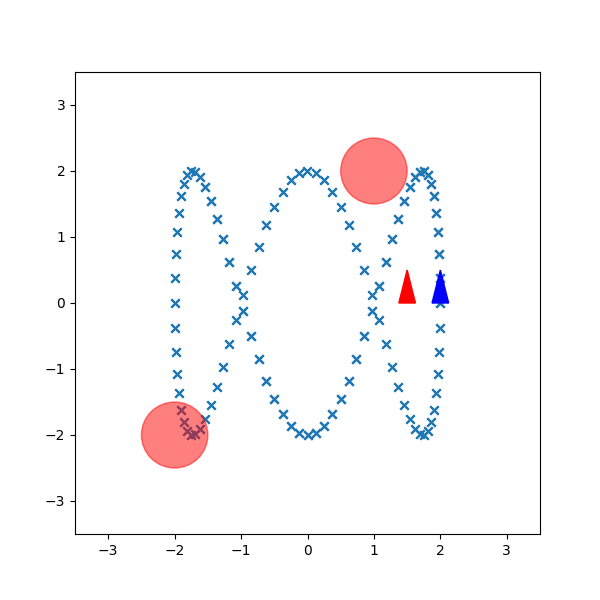

# Trajectory Tracking

## Objective:
The objective is to design a control policy for the differential-drive robot to track a desired reference
position trajectory. We will compare two different approaches for solving the problem in Receding-Horizon Certainty equivalent Control (CEC) and Generalized Policy Iteration (GPI).

<div style="display: flex; justify-content: center;">
  
  
</div>

## Code:
1. Setup the environment:

```
conda create -name env_tracking
conda activate env_tacking
git clone https://github.com/suryapilla/Trajectory-Tracking.git
cd Trajectory-Tracking
pip install -r requirements.txt

```

2. run CEC 
```
python main.py
```

3. run GPI controller
```
python main2.py
```
